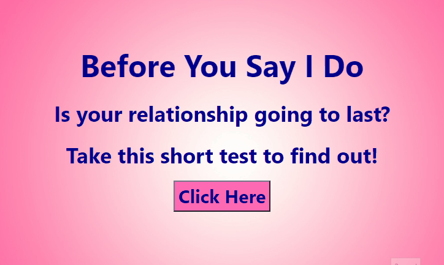
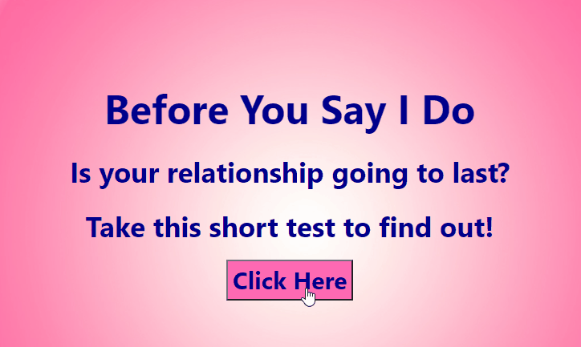

# Background 

About 50% of marriages end in divorce. With this kind of statistic, it would be helpful to have a "test" to see if you and your loved one are going to make it. This test is based on the "Divorce Predictors Scale (DPS) on the basis of Gottman couples therapy."[1] According to Gottman, there are four predictors of divorce, which he called the "four horseman of the apocalypse. Gottman describes them as Criticism, Contempt, Stonewalling and Defensiveness (Gottman, 2014; Gottman and Gottman, 2012)." [1] From these factors and other empirical research, Yöntem, M , Adem, K , İlhan, T , Kılıçarslan, S. (2019) tested and wrote "DIVORCE PREDICTION USING CORRELATION BASED FEATURE SELECTION AND ARTIFICIAL NEURAL NETWORKS". Nevşehir Hacı Bektaş Veli University SBE Dergisi, 9 (1), 259-273. You can find the link to the paper [here](https://dergipark.org.tr/tr/download/article-file/748448). This paper not only includes the prediction algorithms the team used but also the demographics of the subjects.

# Data

  - Contains 54 questions, 170 subjects, and their answers to the questions
  - Of the 170 subjects, 84 were divorced and 86 were happily married
  - Happily married was defined as "those with happy marriages, without any thought of divorce."[1]
  - The answers to each question can be one of the five following choices: 
      - **0**=Never
      - **1**=Seldom
      - **2**=Averagely
      - **3**=Frequently
      - **4**=Always
  - The 'Divorce' column is either a **1**=Happily Married or **0**=Divorced
  - The full dataset can be found [here](https://www.kaggle.com/andrewmvd/divorce-prediction)
  - The exact questions that the subjects were asked can be found in this file [reference.tsv](reference.tsv). 
      - This study was done in Turkey, so some of the questions did not translate well to English. We adjusted those questions using proper grammar and changing gender pronouns         so that the question worked with either spouse. 

# Prediction model

Based on the data, a supervised classification model was used. We found that multiple prediction algorithms worked well with this dataset but chose to use the Grid Search linear model for the application. After running the grid search algorithm with a train/test split sample, our model recieved a 1.0 F1 score. You can find the full prediction code [here](Grid_search_model.py) and the model saved to a binary file [grid_search.sav](grid_search.sav).

The prediction model is run in the application and since the original data had 54 questions, we chose to find the top ten important questions that have the most weight in the prediction model. Using the random forest model found [here](Random_Forest.py), we were able to extrapolate those top ten questions. Taking those ten questions, we redid our grid search model to predict off of those ten questions alone. The model still received a 1.0 F1 score.

# Application

The application is run off of Flask through Python, so if you download all the files, you can fun the application locally. Or you can go [here](heroku app) and share it with others. If you choose to take the test, you will recieve an answer in gif form.

**For those that should stay together**  

**For those that should possibly break up** [2]

# Visualizations

  - Shows how many subjects answered each featured question
  - Built using Tableau public
  - Can be filtered by Happily Married and Divorced Couples
  - File found [here]("Divorce Prediction.twbx")

1 - https://dergipark.org.tr/tr/download/article-file/748448

2 - Disclaimer: This application is for entertainment purposes only. If you are experiencing issues within your relationship, please contact a mental health professional for guidance.
